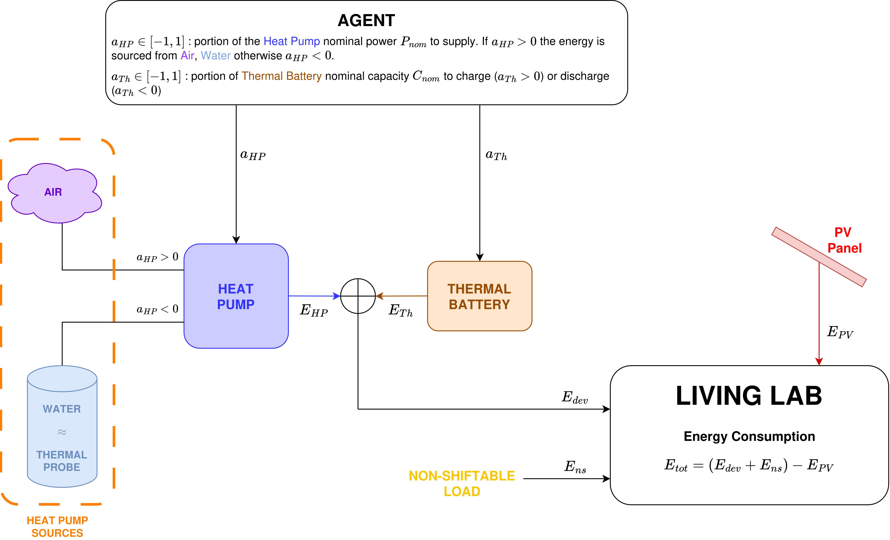

# Living Lab Digital Twin
Official repository for the implementation of the digital twin of the **Living Lab** at the [National Research Council](https://www.pd.cnr.it/) of Padua.

<div align="center">
    
</div>

## 1. 📋 Introduction
Inspired by [CityLearn](https://github.com/citylearn-project/CityLearn) **LivingLab** is a modular and object oriented _Reinforcement Learning_ (**RL**) environment for intelligent building energy management for comfort maintenance.

LivingLab follows the modern [Farama Gymnasium API](https://gymnasium.farama.org/), making it plug-and-play with popular RL libraries like Stable Baselines3.

### 1.1 ✨ Key Features
* **Modular Representation**: the Heat Pump, Thermal Battery and Photovoltaic System are isolated components.
* **Gymnasium Compliant**: ready to use with `env.reset()` and `env.step()`.
* **Highly Customizable**: Easily override the simulation dataset, devices parameters, and building dynamics via environment configurations.

### 1.2 📂 Project Structure
```bash
LivingLab/
├── config/                     # Default JSON configuration files
├── data/                       # Time-series datasets (weather, pricing, loads)
├── ext/                        # Externally imported libraries
│   ├── __init__.py             
│   └── omnisafe/               # Omnisafe library for Safe RL algorithms
├── livinglab/                  # Main environment package
│   ├── __init__.py             # Registers the Gym environments
│   ├── base.py                 # Base classes definition
│   ├── envs/
│   │   └── livinglab_env.py    # Core Gymnasium environment loop
│   ├── components/             # Object-oriented physical assets
│   │   ├── device.py           # Devices physical implementation
│   │   ├── battery.py          # Energy Storage System dynamics
│   │   └── dynamics.py         # Building temperature dynamics
│   └── utils/
│       ├── data_loader.py      # CSV parsing
│       ├── preprocessing.py    # Preprocessing functions for data normalzation
│       ├── wrappers.py         # Wrappers for Observation/Action space normalization
│       └── rewards.py          # Modular reward calculation
└── examples/                   # Example scripts and agent implementations
    └── init_env.py             # Random agent quickstart
    └── train_sb3.py            # Training script with StableBaselines3
    └── train_omnisafe.py       # Training script with Omnisafe
```

### 1.3 ⚙️ Installation
We recommend using a [Miniconda](https://www.anaconda.com/docs/getting-started/miniconda/install/overview) virtual environment.

1. Clone the repository: 
    ```bash
    git clone https://github.com/Isla-lab/LivingLab.git
    ```
2. Setup [Omnisafe](https://github.com/PKU-Alignment/omnisafe):
    ```bash
    # 1. Create the conda environment
    cd LivingLab/ext/omnisafe
    conda env create --file conda-recipe.yaml

    # 2. Install omnisafe
    conda activate safe-livinglab
    pip install -e .
    ```
3. Update and install additional libraries
    ```bash
    # 1. Update torch and torchvision
    pip install torch==2.8.0 torchvision==0.23.0
    
    # 2. Install utilities
    pip install ipywidgets
    pip install ladybug-core
    pip install stable_baselines3==2.0.0
    ```

## 2. 🚀 Quick Start
You can easily use the environment by importing it and and calling calling `.gym.make()`.
```python
import gymnasium as gym
import livinglab # Registers the environment with default configurations

# 1. Initialize the environment
env = gym.make("LivingLab-v0")

# 2. Reset to start the episode
obs, info = env.reset()

done = False
while not done:
    # Sample a random action (e.g., battery charge/discharge rates)
    action = env.action_space.sample()
    
    # Step the environment
    obs, reward, terminated, truncated, info = env.step(action)
    
    done = terminated or truncated

env.close()
```

To have more insights on the environment initialization and usage you can also check out and run the provided test script:
```bash
cd examples
python init_env.py
```

### 2.1 🏗️ Customizing the Environment
You can easily override the default environment settings by passing keyword arguments directly to `gym_make()`. This allows for rapid testing on custom configurations without altering the core code:
```python
env = gym.make(
    "LivingLab-v0", 
    kawrgs={
        "episode_length": 24 # <- daily episodes instead of the full dataset
    }
)
```

Alternatively, you can check [config/default.json](config/default.json) out to understand how to define JSON configuration files for custom environment initializaton. Once you defined your configuration file, you can override the default environment settings:
```python
import livinglab
import gymnasium as gym
from livinglab.envs.livinglab_env import LivingLabEnv

# 1. Your JSON config file
path = "<path_to_your_JSON_configs>"

# 2a. You can use `gym_make()`
kwargs = LivingLab.from_json(config=path, init=False)
env = gym.make(
    "LivingLab-v0", 
    kawrgs=kwargs
)

# 2b. Or you can retrieve an environment instance
env = LivingLab.from_json(config=path, init=True)
```

## 3. 🤖 Omnisafe Compatability
In [ext/omnisafe/omnisafe/envs/livinglab_env.py](ext/omnisafe/omnisafe/envs/livinglab_env.py) we implemented a `LivingLabOmnisafe` class that allows agents to train on `LivingLabEnv` via Safe RL algorithms provided by the Omnisafe library.

You can easily instanitate an Omnisafe agent to train on `LivingLabEnv` as follows:
```python
from ext import omnisafe
from livinglab.envs.livinglab_env import LivingLabEnv

# 1. Load env configs from your JSON config file
path = "<path_to_your_JSON_configs>"
env_cfgs = LivingLab.from_json(config=path, init=False)

# 2. Define the configurations for the Omnisafe agent
custom_cfgs = {
    'seed': ...,
    'train_cfgs': {
        # Training configurations (e.g. total training steps)
    },
    'algo_cfgs': {
        'obs_normalize': False, # <- DO NOT SET THIS TO True!
        # Algorithm specific configurations
    },

    # --- LIVINGLAB CONFIGURATIONS ---
    'env_cfgs': env_cfgs
}

# 3. Define and train the agent
agent = omnisafe.Agent('<algo>', 'LivingLab-v0', custom_cfgs=custom_cfgs)
agent.learn()
```

You can check and run a given example at [examples/train_omnisafe.py](examples/train_omnisafe.py) for training an Omnisafe agent via PPO:
```bash
cd examples/
python train_omnisafe.py
```

## 4. 🔧 Future Work
The environment will be continuously updated with future work covering:
* improved devices and building dynamics modelling. 